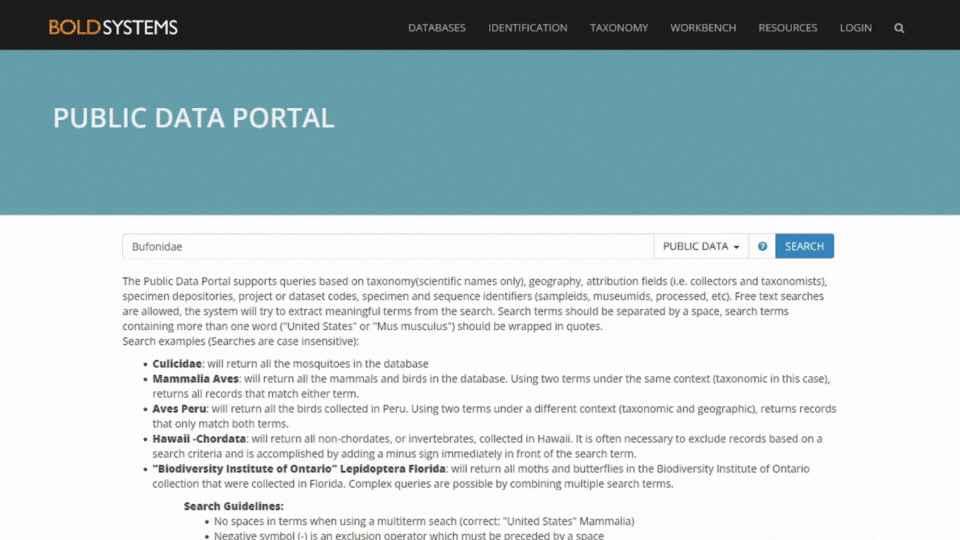

<p align="center">
  
</p>

<p align="center">
  <a href="https://www.buymeacoffee.com/lprabelo" target="_blank">
    
  </a>
</p>

[](https://doi.org/10.1016/j.ecoinf.2024.102970)

# Contents Overview
- [System Overview](#system-overview)
- [How to cite dataFishing](#how-to-cite-datafishing)
- [License](#license)
  - The Hitchhiker's Guide to ***dataFishing***
    - [Change Log](#change-log)
    - [Getting Started](#getting-started)
      - [Prerequisites](#prerequisites)
      - [Installation of dependencies](#installation-of-dependencies)
      - [Download the ***dataFishing*** script file](#download-the-datafishing-script-file)
      - [Usage](#usage)
      - [Run ***dataFishing***](#run-datafishing)
        - [With **Bold Systems TSV File**](#with-bold-systems-tsv-file)
        - [With a **Text File**](#with-a-text-file)
        - [To execute](#to-execute)
      - [Outputs Files](#outputs-files)
        - [IUCN Example](#iucn-example)
        - [WoRMS Example](#worms-example)
- [dataFishing Development Team](#datafishing-development-team)
- [Contact](#contact)

***
# System Overview
##### [:rocket: Go to Contents Overview](#contents-overview)
<p align="center">
  
</p>

***dataFishing*** is an efficient Python tool and user-friendly web-form for mining Mitochondrial/Chloroplast Sequences and biodiversity data. It is designed to facilitate and automate access to information from various databases, including **NCBI GenBank**, **Bold Systems**, **GBIF**, **WoRMS**, and **IUCN**. ***dataFishing*** is faster and more efficient than other tools for obtaining taxonomic information from the databases consulted. It also allows the retrieval of **DNA sequences**, **Common Names**, **Synonyms**, **Conservation Status**, and **Occurrence Points** of species. The ***dataFishing*** repository, hosted on **GitHub** and **licensed under MIT**, is a **freely accessible** resource for the **scientific community**.
***  
### How to cite ***dataFishing***
##### [:rocket: Go to Contents Overview](#contents-overview)
When referencing the ***[dataFishing](https://doi.org/10.1016/j.ecoinf.2024.102970)*** tool, please cite it appropriately in your academic or professional work. Here is an example of how to cite the ***dataFishing*** tool in your work:
```
Rabelo, L., Sodré, D., Balcázar, O. D. A., do Rosário, M. F., Guimarães-Costa, A. J., Gomes, G., Sampaio, I., & Vallinoto, M. (2025). dataFishing: An efficient Python tool and user-friendly web-form for mining mitochondrial and chloroplast sequences, taxonomic, and biodiversity data. Ecological Informatics, 85, 102970. https://doi.org/10.1016/j.ecoinf.2024.102970
```
***  
# Licence
***dataFishing*** is released under the **MIT License**. This license permits reuse within proprietary software provided that all copies of the licensed software include a copy of the MIT License terms and the copyright notice.

For more details, please see the MIT License.
***
# The Hitchhiker's Guide to ***dataFishing***
## Change Log
##### [:rocket: Go to Contents Overview](#contents-overview)
- **Python Version 1.0.0** (2024-10-01)
  - Initial release of ***dataFishing***.
- **Python Version 1.0.1** (2024-10-15)
  - Added the ability to download sequence data from BOLD System and/or GenBank.
  - Added the ability to obtain data of Threats from the IUCN database.

## Getting Started
##### [:rocket: Go to Contents Overview](#contents-overview)
- ## Prerequisites
Before you run ***dataFishing***, make sure you have the following prerequisites installed on your system:
- **Python Environment**
    - Python **version 3.12 or higher**
    - conda (optional)
- Dependencies
    - `aiohttp`
    - `requests `
    - `pandas`
    - `biopython`
    - `xlsxwriter`
    - `openpyxl`
    - `SynGenes`
***  
### Installation of dependencies
##### [:rocket: Go to Contents Overview](#contents-overview)
There are tree ways to install ***dataFishing*** dependencies:
1. Through pip: Install ***dataFishing*** dependencies directly using pip: 
- 1.1. Open the **Terminal** or **Python Environment**
- 1.2. Execute the Following Code:
```shell
pip install aiohttp requests pandas biopython openpyxl xlsxwriter SynGenes
```
> [!NOTE]
> This command will install the necessary packages specified in the command. If any required packages are missing, the script will handle their installation.
2. By cloning the GitHub repository: Clone the source code of ***dataFishing*** from GitHub:
- 2.1. Open the **Terminal** or **Python Environment**
- 2.2. Execute the Following Code:
```shell
git clone https://github.com/luanrabelo/dataFishing.git
cd dataFishing  
pip install -r requirements.txt
```
> [!NOTE]
> This command will clone the repository, and then you should navigate to the cloned directory to install ***dataFishing*** and its dependencies using pip.  
3. With **Conda Environment**
```shell
conda create -n dataFishing_env python=3.12
conda activate dataFishing_env
pip install aiohttp requests pandas biopython openpyxl xlsxwriter SynGenes
```
or
```shell
conda env create --file environment.yml
conda activate dataFishing_env
```
> [!NOTE]
> This command creates an **environment in conda** with **Python version 3.12**, then activates the created environment, and finally installs the necessary libraries for **dataFishing**.  

***  
## Download the ***dataFishing*** script file
##### [:rocket: Go to Contents Overview](#contents-overview)
You can download the ***dataFishing*** script file using two different methods:
1. By cloning the GitHub repository: Clone the source code of ***dataFishing*** from GitHub:
- 1.1. Open the **Terminal** or **Python Environment**
- 1.2. Execute the Following Code:
```shell
git clone https://github.com/luanrabelo/dataFishing.git
cd dataFishing  
```
2. Obtaining the Latest Release:
  - Visit the Releases page of the dataFishing repository on GitHub.
  - Look for the most recent release (usually tagged with version numbers).
  - Download the script file associated with that release (usually in a .zip or .tar.gz format).

> [!NOTE]
> Choose the method that suits you best, and you’ll have the dataFishing script ready for use!
***  
## Usage
##### [:rocket: Go to Contents Overview](#contents-overview)
```
Usage: dataFishing.py [options]
Options:
  -h, --help                    [Show this help message and exit.]

  --input string {Mandatory}    [A text file with species names listed on separate lines or a BOLD System TSV file.]

  --{databases} True            [Select the database(s) you wish to query. Default is --all True]
                                {--iucn, --ncbi, --bold, --gbif, --worms}

  --email {Mandatory}*          [Please include a previously registered email with NCBI using this link: https://account.ncbi.nlm.nih.gov/signup/]

  --download {Optional}         [Download sequence data from BOLD System and/or GenBank. Default is False]

  --genesList {Mandatory*}      [A text file with genes names listed on separate lines. See Table below for more information]

  --verbose                     [This argument specifies if the verbose mode should be enabled or disabled. Default is True.]

  --log                         [This argument specifies if the log mode should be enabled or disabled. Default is False.]
  
  * if --download True
```

| Category | Mitochondrial Genes | Chloroplast Genes |
|----------|---------------------|-------------------|
| rRNA | *12S; 16S* | - |
| Mitochondrial Complex I | *ND1; ND2; ND3; ND4; ND4L; ND5; ND6* | - |
| Mitochondrial Complex III | *CYTB* | - |
| Mitochondrial Complex IV | *COI; COII; COIII* | - |
| Mitochondrial Complex V | *ATP6; ATP8* | - |
| Control Region | *Control Region* | - |
| ATP Synthase | - | *atpA; atpB; atpE; atpF; atpH; atpI* |
| Cytochrome b/6f Complex | - | *petA; petB; petD; petE; petG; petL; petN* |
| DNA dependent RNA polymerase | - | *rpoA; rpoB; rpoC1; rpoC2* |
| Large Subunit of Ribosome | - | *rpl2; rpl14; rpl16; rpl20; rpl22; rpl23; rpl32; rpl33; rpl36* |
| NADH-dehydrogenase | - | *ndhA; ndhB; ndhC; ndhD; ndhE; ndhF; ndhG; ndhH; ndhI; ndhJ; ndhK* |
| PhotoSystem I-II | - | *psaA; psaB; psaC; psaI; psaJ; psaM; psb30; psbA; psbB; psbC; psbD; psbE; psbF; psbH; psbI; psbJ; psbK; psbL; psbM; psbN; psbZ* |
| Small Subunit of Ribosome | - | *rps2; rps3; rps4; rps7; rps8; rps11; rps12; rps14; rps15; rps16; rps18; rps19* |
| Rubisco | - | *rbcL* |
| Others | - | *accD; ccsA; cemA; chlB; chlL; chlN; clpP; clpP1; cysA; cysT; ftsH; infA; lhbA; matK; pafI; pafII; pbf1; psb30; ycf1; ycf2; ycf3; ycf4; ycf12; ycf15;* |

### Genes List **Text File** Example
Example Mitocondrial Genes
```
COI
COII
COIII
ND5
CYTB
Control Region
```
> [!NOTE]
> Copy and paste into a new text document. Be sure to save the file with the correct extension. For example, if you're working with text file, save the file with the `.txt` extension.
***  
## Run ***dataFishing*** 
##### [:rocket: Go to Contents Overview](#contents-overview)
### With **Bold Systems TSV File**
To execute the ***dataFishing*** tool using data sourced from **Bold Systems**, ensure that you are searching for a specific systematic term related to a particular species, such as **order**, **family**, or **genus** (Figure 1) or see **Example** folder.
<p align="center">
  
</p>

Figure 1. Get TSV data from **Bold Systems**. On the website, click “**Explore the Data**”, and a search field will appear for the user. Thereafter, type the term you want to search, for example: **Bufonidae**. After searching, find the option “**Combined**:” and click the option to get a **TSV file**.

### With a **Text File**
Example
```
Ailuropoda melanoleuca
Ara macao
Balaenoptera musculus
Carcharodon carcharias
Dendrobates tinctorius
Elephas maximus
Eretmochelys imbricata
Gorilla gorilla
Pan paniscus
Panthera tigris
```
> [!NOTE]
> Copy and paste into a new text document. Be sure to save the file with the correct extension. For example, if you're working with text file, save the file with the `.txt` extension.
***
## To execute 
##### [:rocket: Go to Contents Overview](#contents-overview)
- To run the dataFishing script:
  - If you are using a **conda environment**, activate it with the following command:
  ```shell
  conda activate {your_environment_name}
  ```
  > Replace {your_environment_name} with the name of your environment.
  - Navigate to the folder containing the ***dataFishing*** script.

Then, execute the command below.
```shell
dataFishing.py --input Examples/SpeciesNames.txt --all True --email your@email.com --download True --genesList Examples/genesList.txt --verbose True --log True
```

`dataFishing.py`: The Python script for ***dataFishing*** is available on GitHub:
 github.com/luanrabelo/dataFishing.

`-i Examples/SpeciesNames.txt`: Input file from the `Examples` folder*.

`--{databases} True`: Select the database(s) you wish to query. For instance, use `--worms True` to search only in the WoRMS database, or `--all True` to search across all databases (see Table below). You can also use combinations of databases, such as `--bold True` `--gbif True`, to conduct queries in both the BOLD and GBIF databases simultaneously. Default is `--all True`.
| dataBase | data | Parameters |
| --- | --- | --- | 
| `IUCN` | Status Conservation; Synonyms Names; Taxonomy; Common Names; Country Occurrence; Habitats; Threats | `--iucn True` |
| `NCBI GenBank` | Sequences; Taxonomy | `--ncbi True` |
| `Bold Systems` | BINs; Collection Site; Depository; Sample IDs; Sequences; Taxonomy | `--bold True` |
| `GBIF` | Occurrence; Synonyms; Vernacular Names; Verbatim Name; Taxonomy | `--gbif True` |
| `WoRMS` | Taxonomy; Species Status Vernaculars; Authors | `--worms True` |

`--email`: Please include a previously registered email with NCBI using this link: https://account.ncbi.nlm.nih.gov/signup/*. 

`--download`: Download sequence data from BOLD System and/or GenBank. `Default is False`.

`--genesList`: A text file with genes names listed on separate lines.

`--verbose`: This argument specifies if the verbose mode should be enabled or disabled. `Default is True`.

`--log`: This argument specifies if the log mode should be enabled or disabled. `Default is False`.

> [!NOTE]
> \* Mandatory 
***
### Outputs Files
##### [:rocket: Go to Contents Overview](#contents-overview)
- #### IUCN Example
| **Kingdom** | **Phylum**  | **Order**        | **Family**        | **Genus**       | **Species**              | **Common Names**                          | **Status Conservation** | **Synonyms Names**                  | **Threats**                      |
|:-----------:|:-----------:|:----------------:|:-----------------:|:---------------:|:------------------------:|:-----------------------------------------:|:------------------------:|:------------------------------------:|:---------------------------------:|
| Animalia    | Chordata    | Lamniformes      | Lamnidae          | *Carcharodon*   | *Carcharodon carcharias* | White Shark, Great White Shark (eng)     | Vulnerable (VU)          | *Squalus carcharias* Linnaeus, 1758 | Biological resource use           |
| Animalia    | Chordata    | Proboscidea      | Elephantidae      | *Elephas*       | *Elephas maximus*        | Asian Elephant, Indian Elephant (eng)    | Endangered (EN)          | -                                  | Residential & commercial development |
| Animalia    | Chordata    | Primates         | Hominidae         | *Pan*           | *Pan paniscus*           | Bonobo, Pygmy Chimpanzee (eng)           | Endangered (EN)          | *Pan satyrus*                      | Residential & commercial development |
| Animalia    | Chordata    | Testudines       | Cheloniidae       | *Eretmochelys*  | *Eretmochelys imbricata* | Hawksbill Turtle (eng)                   | Critically Endangered (CR)| *Testudo imbricata* Linnaeus, 1766  | Climate change & severe weather   |
| Animalia    | Chordata    | Carnivora        | Felidae           | *Panthera*      | *Panthera tigris*        | Tiger (eng), Tigre (fre, spa)            | Endangered (EN)          | *Felis tigris* Linnaeus, 1758       | Climate change & severe weather   |


- #### WoRMS Example
| AphiaID | Kingdom | Phylum | Class | Order | Family | *Genus* | *Species* | Species Status | Authority | Link |
| :---: | :---: | :---: | :---: | :---: | :---: | :---: | :---: | :---: | :---: | :---: |
| ... | ... | ... | ... | ... | ... | ... | ... | ... | ... |
| 401555 | Animalia | Chordata | Teleostei | Carangiformes | Carangidae | *Alectis* | *Alectis alexandrina* | **accepted** | (Geoffroy Saint-Hilaire, 1817) | https://www.marinespecies.org/aphia.php?p=taxdetails&id=401555
| ... | ... | ... | ... | ... | ... | ... | ... | ... | ... | ... |
***
### ***dataFishing*** Development Team
##### [:rocket: Go to Contents Overview](#contents-overview)
- **Luan Rabelo**
- Clayton Sodré
- Oscar Balcázar
- Murilo Furtado
- Aurycéia Guimarães-Costa
- **Iracilda Sampaio**
- **Marcelo Vallinoto**
***  
### Contact
##### [:rocket: Go to Contents Overview](#contents-overview)
For reporting bugs, requesting assistance, or providing feedback, please reach out to **Luan Rabelo**:
```
luanrabelo@outlook.com
```
***  